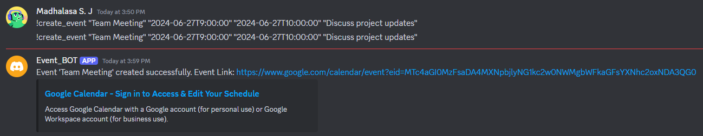
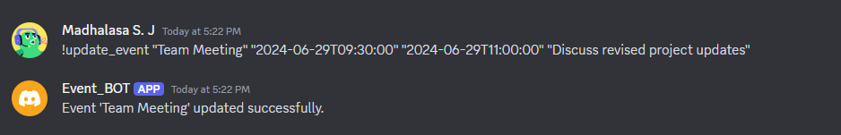
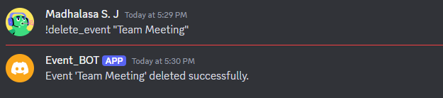
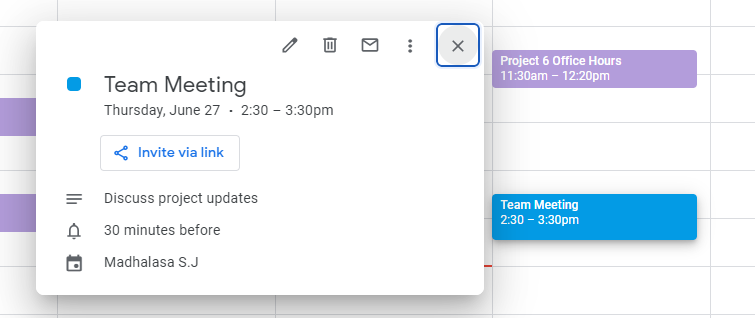

# Discord_Calendar_Agent
This project is a Discord bot that integrates with Google Calendar to manage events. It allows users to create, update, and delete events from a Google Calendar directly through Discord commands.

## Features

- Create events in Google Calendar from Discord.
- Update existing events in Google Calendar from Discord.
- Delete events from Google Calendar from Discord.

## Prerequisites

- Python 3.8 or higher
- A Discord bot token
- Composio API Integrations(GITHUB & GOOGLE CALENDAR)
- Google Calendar API credentials


## Installation

1. Clone the repository:
   ```bash
   git clone https://github.com/yourusername/Discord_Calendar_Agent.git
   cd Discord_Calendar_Agent


2. Create and activate a virtual environment:

    ```bash
    python -m venv myenv
    source myenv/bin/activate 

3. Install the required packages:

   ``` bash
    
    pip install -r requirements.txt

4. Create a .env file in the root directory of your project and add your Discord bot token:
    ```bash
      DISCORD_TOKEN=your_discord_bot_token
      Add your Google Calendar API credentials in a credentials.json file in the root directory of your project.

5.Create a config.json file in the root directory with the following structure:


    ```bash
        {
            "google_calendar": {
                "api_key": "your_google_api_key"
            },
            "Event_BOT": "your_discord_bot_token"
        }


## Usage
  1. Run the bot:
      ```bash
        python bot.py

2. Use the following commands in Discord to interact with the bot:
   

      i. Create an event:
    
          
          !create_event "Team Meeting" "2024-06-27T9:00:00" "2024-06-27T10:00:00" "Discuss project updates"
   
          
     ii. Update an event:

   
        
          !update_event "Team Meeting" "2024-06-28T9:30:00" "2024-06-28T11:00:00" "Discuss revised project updates"
    
    
    iii. Delete an event:

   
        
        !delete_event "Team Meeting"
   

## Project Structure

Discord_Calendar_Agent/

│

├── bot.py                 # Main bot script

├── config.json            # Configuration file

├── credentials.json       # Google Calendar API credentials

├── .env                   # Environment variables

├── requirements.txt       # Python dependencies

├── .gitignore             # Git ignore file

└── README.md              # Project README file


## License
This project is licensed under the MIT License. See the LICENSE file for details.

## Acknowledgments
- Composio dev community
  
- Discord.py developers and community

- Google Cloud Platform and Google Calendar API developers


